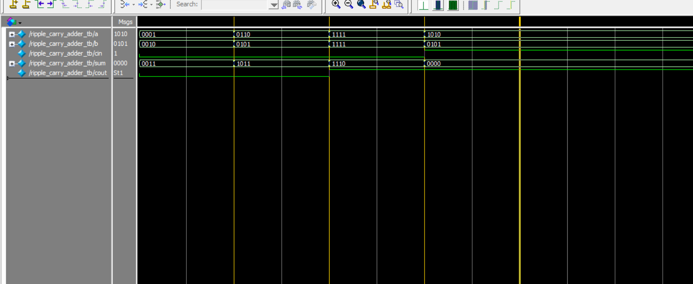

## Verilog Ripple Carry Adder Simulation

This project implements a 4-bit ripple carry adder in Verilog, using four full adders connected in series.

### Files Included

- `full_adder.v` — 1-bit full adder module  
- `ripple_carry_adder.v` — 4-bit ripple carry adder (connects 4 full adders)
- `ripple_carry_adder_tb.v` — Testbench for simulation
- `ripple_carry_adder.vcd` — VCD file for waveform visualization
- `monitor_log.txt` — Simulation output log (text form)
- `wave_ripple_carry_adder_tb.png` — Waveform screenshot from ModelSim

### Waveform Screenshot

